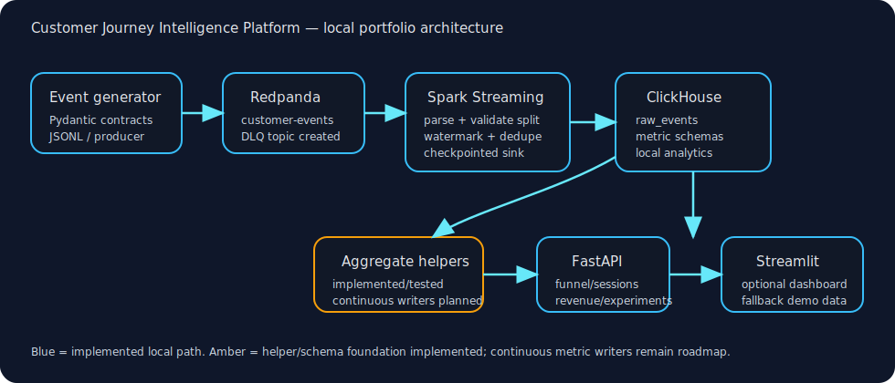
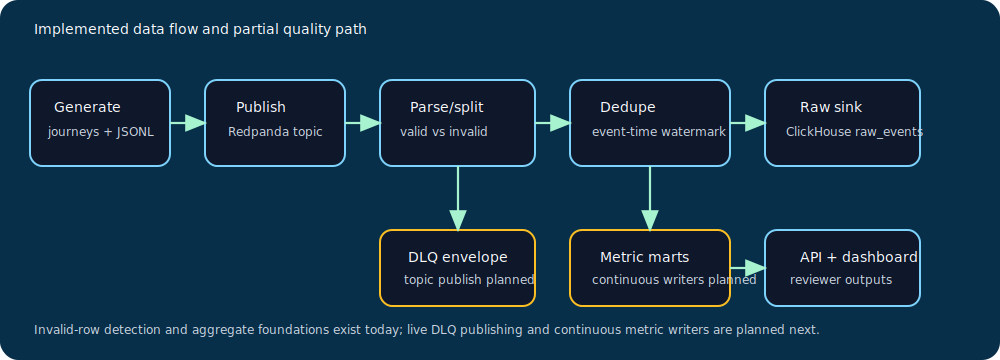
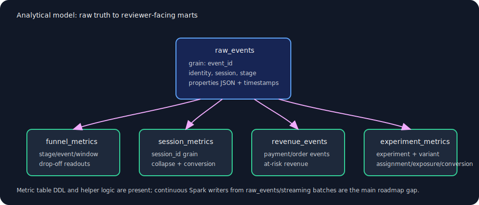

# Pipeline design

The platform models an ecommerce customer journey as an event stream, then layers validation, streaming ingestion, warehouse storage, analytics APIs, and a dashboard over that stream.

## Business questions the pipeline is built to answer

- Which journey stages lose the most sessions?
- Which checkout or payment failures put the most revenue at risk?
- Which sessions reached checkout but did not convert?
- Which experiment variants have higher assignment, exposure, and conversion counts?
- Can operators inspect the raw event trail behind an aggregate?

## Current data flow

1. `JourneySimulator` emits deterministic synthetic ecommerce journeys as Pydantic `EcommerceEvent` objects.
2. The CLI writes JSONL samples for local demos or publishes those events to Redpanda with `confluent-kafka`.
3. PySpark Structured Streaming reads the `customer-events` Kafka topic, preserves raw JSON, projects contract fields, separates invalid rows, applies a 10-minute watermark on `occurred_at`, and deduplicates by `event_id`.
4. Valid rows can be printed to a console sink or written into ClickHouse `customer_journey.raw_events` via checkpointed `foreachBatch`.
5. ClickHouse init SQL creates raw and analytical tables. Raw loading is implemented; continuous writers for every metric mart are still planned.
6. FastAPI exposes local portfolio endpoints for funnel, session, revenue leakage, and experiment analytics.
7. Streamlit provides an optional visual dashboard. It can call the API via `CJI_API_BASE_URL` or use deterministic fallback/sample data for no-Docker demos.

## Analytical model

| Model | Grain | Current status | Used by |
|---|---|---|---|
| `raw_events` | One row per `event_id` | Implemented raw sink and JSONL loader | API exploration, audit trail, demo queries |
| `funnel_metrics` | `(window_start, journey_stage, event_name, experiment_id, variant_id)` | Table and helper implemented; continuous writer planned | `/funnel`, dashboard funnel section |
| `session_metrics` | `session_id` | Table and helper implemented; continuous writer planned | `/sessions`, dashboard explorer |
| `revenue_events` | Revenue-relevant event | Table and helper implemented; continuous writer planned | `/revenue-leakage`, revenue dashboard |
| `experiment_metrics` | `(window_start, experiment_id, variant_id)` | Table and helper implemented; continuous writer planned | `/experiments`, experiment dashboard |

## Implemented streaming behaviors

- Kafka-compatible Redpanda source options target the configured topic and bootstrap servers.
- Raw payloads are retained so rejected events can be explained.
- Valid/invalid rows are split before writes.
- Event-time watermarking bounds duplicate state.
- `event_id` dedupe protects the raw ClickHouse table from replayed events.
- The ClickHouse sink uses a stable checkpoint location for repeatable local runs.

## Deliberate limitations

- Live publishing of DLQ envelopes to `customer-events-dlq` is not wired into the Spark job yet.
- The analytical metric tables are schema-ready but not continuously populated by Spark writers in the current codebase.
- The dashboard is a portfolio visualization, not a production BI deployment.
- The project is local-first and does not include cloud infrastructure, managed secrets, or production alerting.
